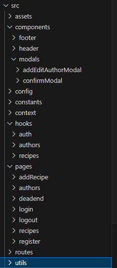

Proyecto de Programación Web - Aplicación SPA con React

Esta es una aplicación web desarrollada como trabajo práctico integrador en el
marco de la asignatura de Programación Web. La aplicación es una SPA (Single Page
Application) construida en React y permite realizar un CRUD completo sobre dos entidades: una entidad principal (Recetas) y una entidad de soporte (Autores)

Funcionalidades principales:

Autenticación
Módulo de ABMC tanto para Recetas como para Autores
Navegación SPA
Uso de Hooks

Tecnologías Utilizadas:

Hosting gratuito: Despliegue en Vercel (Vercel.com) para acceso en línea de la aplicación.
Git: Uso de Git para el control de versiones y colaboración.

Estructura del proyecto

Instrucciones de uso:

Clonar el repositorio
Instalar dependencias
Iniciar el servidor de desarrollo

/recipes    página completa con las recetas agregadas
/add-recipe     página para agregar una nueva receta
/login      página para ingresar como un usuario ya registrado
/register   página para crear un nuevo usuario
/authors    página para agregar, editar y borrar autores (Sólo admin)

Imágenes de la aplicación:

Contribuidores:

Ybañez Cesar https://github.com/Juk-Juk
Franco Sanchez https://github.com/MastahhDev